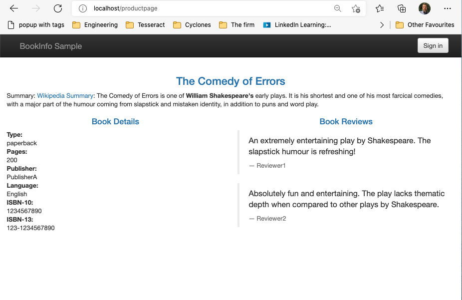

# The Data Plane


> Source: https://istio.io/latest/docs/ops/deployment/architecture/

## Installing Istio

### Prerequisites

**IMPORTANT** You must increase your memory allocation in your local cluster for Istio, or it will not run properly.

	Docker menu > Preferences > Resources
	
	Set CPUs: 4 (6 preferred)
	Set Memory: 5GB (6 preferred)

### Installation

Let's download the Istio bits:

	mkdir istio && cd istio
	curl -L https://istio.io/downloadIstio | sh -

This fetches the latest stable version.

Let's install it with the demo profile:

	cd istio-1.9.5
	istioctl install --set profile=demo -y

Check it's up and running:

	kubectl -n istio-system get deploy
	kubectl -n istio-system get IstioOperator installed-state -o yaml

### Enabling sidecar injection

We want Istio to automatically add the necessary sidecars to our Pods. We do this by labelling the namespace that will host the application with `istio-injection=enabled`

    kubectl label namespace default istio-injection=enabled

### Accessing the gateway

Let's find the address of the Istio Ingress Gateway.

```
$ kubectl get svc istio-ingressgateway -n istio-system
NAME                   TYPE           CLUSTER-IP       EXTERNAL-IP   PORT(S)   AGE
istio-ingressgateway   LoadBalancer   172.21.109.129   localhost     ...       17h
```

> Note the `EXTERNAL-IP` and ports, e.g. `localhost` and `80:someport/TCP`.

## The bookinfo application

We will use the 'Book Info' demo application to illustrate Istio.

Let's install it:

    kubectl apply -f https://raw.githubusercontent.com/istio/istio/release-1.10/samples/bookinfo/networking/bookinfo-gateway.yaml

### Let's test it

Open this in your browser: http://localhost/productpage

> Note, replace `localhost` with the external IP and port of the gateway in the previous section.

You should see the following page:



### Exploring Istio

Let's explore the Istio configuration.

