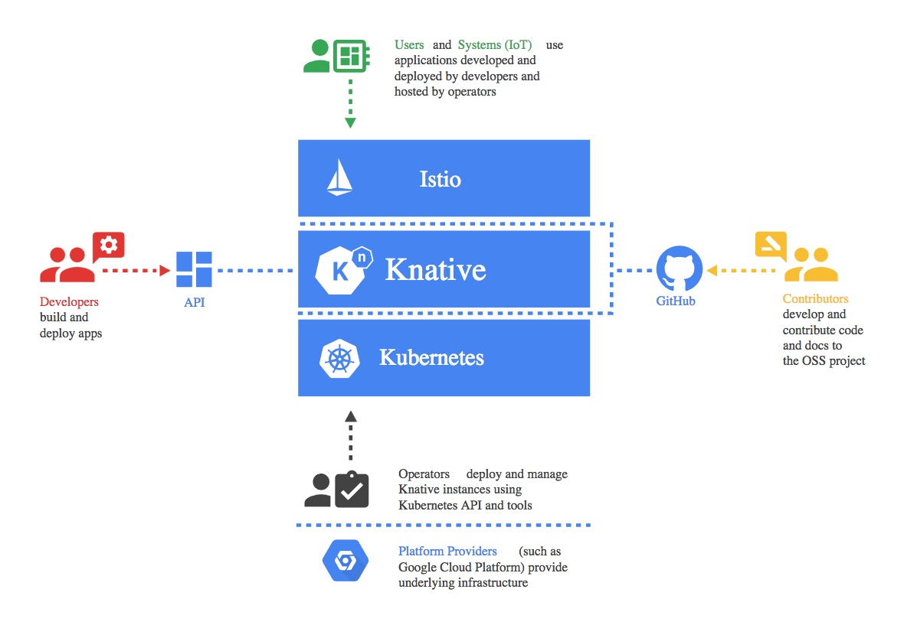

# Knative



> Source: https://github.com/knative/docs/

Install core:

```
kubectl apply -f https://github.com/knative/serving/releases/download/v0.22.0/serving-crds.yaml
kubectl apply -f https://github.com/knative/serving/releases/download/v0.22.0/serving-core.yaml
```

Add Istio network plugin:

```
kubectl apply -f https://github.com/knative/net-istio/releases/download/v0.22.0/net-istio.yaml
```

Set up default domain:

```
curl -LOs https://github.com/knative/serving/releases/download/v0.22.0/serving-default-domain.yaml

sed 's/xip.io/nip.io/g' serving-default-domain.yaml | kubectl apply -f -
```

> Note the dash at the end; this applies the YAML from stdin.

Let's turn off Istio's sidecar injection:

```
kubectl label namespace default istio-injection-
```

> Note the dash at the end; this removes the label.

## The Knative Service

Let's create our first Knative Service (not to be confused with a Kubernetes Service object).

```yaml
apiVersion: serving.knative.dev/v1
kind: Service
metadata:
  name: my-app
spec:
  template:
    spec:
      containerConcurrency: 20
      containers:
      - image: nginx:1.7.9
        name: my-app
        ports:
          - containerPort: 80
```

At first glance, this is very similar to the Pod we defined at the start of the course.

The difference is that the Knative Service comes with a huge number of benefits vs. a Pod:

| Feature                   | Pod                        | Knative Service         |
|---------------------------|----------------------------|-------------------------|
| Auto restart on crash     | App crash, same node only  | Loss of node, app crash |
| Auto-scaling              | Requires HPA object        | Automatic               |
| Scaling metrics (default) | (via HPA) CPU, memory      | Requests per second     |
| Scale to zero             | Not supported              | Automatic               |
| Rolling deployments       | Requires Deployment object | Automatic               |

## Testing autoscaling

We're going to demonstrate Knative's autoscaling and scale-to-zero behaviour with a load test.

Note that in our Knative Service, we specified that each pod could handle 20 concurrent requests:

	containerConcurrency: 20

This allows Knative to scale the number of pods based on the request throughput. This can be a far more useful 'real world' scaling metric compared with CPU or memory.

### Prerequisites

- Install `hey` - `brew install hey`
- Install `watch` - `brew install watch`

Let's watch the running pods:

	watch 'kubectl get pods | grep my-app'

Initially, there should not be any pods running. This is expected as our Knative Service has not received any traffic.

### Running the load test

We are going to fire 10,000 requests at our application, using 50 concurrent connections.

	hey -n 10000 -c 50 http://my-app.default.127.0.0.1.nip.io/

As the first wave of requests are received, Knative initialises pods for our application:

    my-app-00001-deployment-6698d4bb94-96lzv   0/3     Init:0/1   0          5s
    my-app-00001-deployment-6698d4bb94-bjnjp   0/3     Init:0/1   0          5s
    my-app-00001-deployment-6698d4bb94-v5ps7   0/3     Init:0/1   0          5s

> Since we specified each pod could handle 20 concurrent requests, and our load test is sending 50 concurrent requests, we need 3 pods.

The pods enter the Running state and serve the traffic:

    my-app-00001-deployment-6698d4bb94-96lzv   3/3     Running   0          29s
    my-app-00001-deployment-6698d4bb94-bjnjp   3/3     Running   0          29s
    my-app-00001-deployment-6698d4bb94-v5ps7   3/3     Running   0          29s

The load test finishes, with no dropped connections, even though there were no running pods when the test started. This is a key feature of Knative - requests are queued until there are pods to serve them.

After a period of inactivity, Knative terminates the unused pods:

    my-app-00001-deployment-6698d4bb94-96lzv   2/3     Terminating   0          90s
    my-app-00001-deployment-6698d4bb94-bjnjp   2/3     Terminating   0          90s
    my-app-00001-deployment-6698d4bb94-v5ps7   2/3     Terminating   0          90s


After termination, there are no longer any pods running, saving resources used by the application. As soon as our application receives traffic, Knative will create pods.
